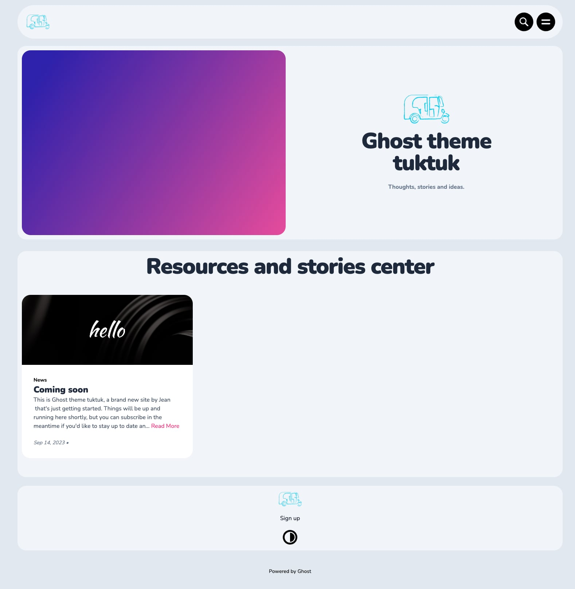
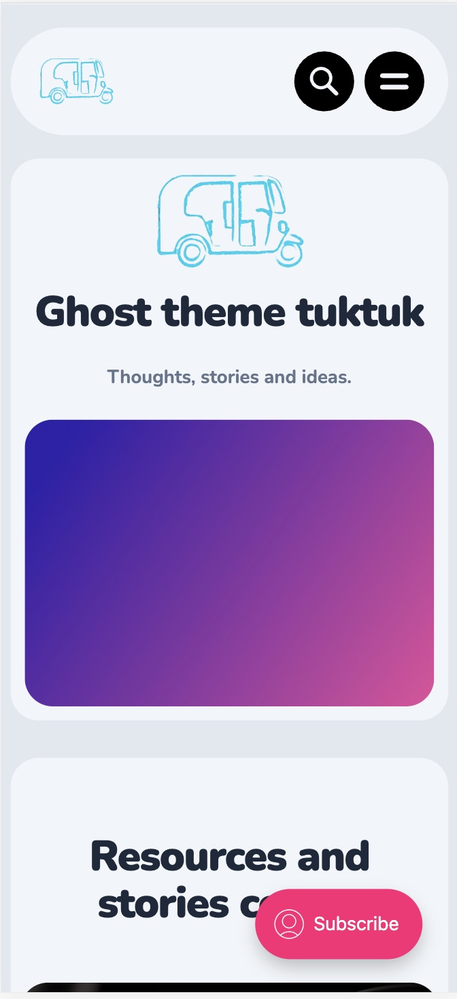

# Tuktuk

**Tuktuk** is a minimal theme for the Ghost blogging platform.



## Description

Tuktuk offers a sleek and modern interface for Ghost bloggers, providing an immersive reading experience. 

- **Version**: 1.2.3
- **Ghost Compatibility**: >=5.0.0
- **License**: MIT
- **Demo**: [Tuktuk Demo](https://demo-ghost.jean-nguyen.dev)
- **Author**: [Jean](https://jean-nguyen.dev) | contact@jean-nguyen.dev
- **Contributors**: Alpha Linlavong

## Features

- Customizable navigation layout with options for logo positioning.
- Multiple font options for titles and body content.
- Varied header styles for diversified look.
- Grid or List based feed layout.
- Configurable post image styles.
- Custom email sign up prompts.

... and more. Check the configuration section for all customization options.

## Installation

Clone the repository or download the theme from its GitHub [repository](https://github.com/jibenight/Ghost-theme-tuktuk).

```bash
git clone https://github.com/jibenight/Ghost-theme-tuktuk.git
```

Follow the Ghost platform's guidelines for theme installation.

## Development

To make changes to the styles or functionality, you can use the provided scripts:

```bash
# Build the theme
npm run build

# Start the development server with hot-reloading
npm run dev

# Run gulp tasks
npm run gulp

# Compress the theme for distribution
npm run precompress
npm run compress
```

## Issues

If you encounter any bugs or have feature suggestions, please create an issue on the [GitHub repository](https://github.com/jibenight/Ghost-theme-tuktuk/issues).

## Screenshots

**Desktop Preview**:


**Mobile Preview**:


## License

This project is licensed under the MIT License. See the [MIT License](LICENSE) for details.

---

Made with 💙 by [Jean](https://jean-nguyen.dev).
